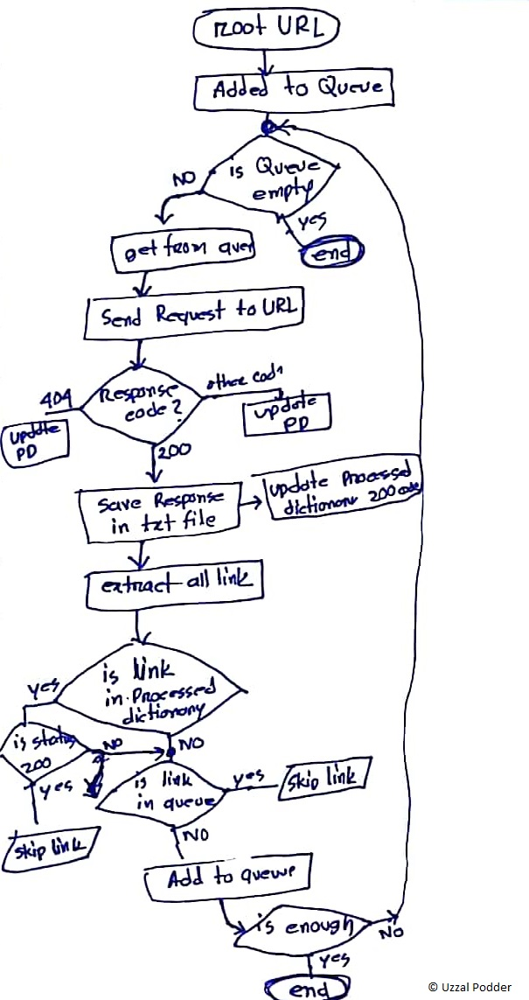

# Multithreaded Bangla Wikipedia Data Crawler  

### How To Use:
 Open `MainRun.py` and change the root url in `ROOT_URL` and limit the max page number in `MAX_NUM`

For example. `ROOT_URL = 'https://bn.wikipedia.org/wiki/%E0%A6%95%E0%A7%8D%E0%A6%B0%E0%A7%80%E0%A6%A1%E0%A6%BC%E0%A6%BE'`

then run `python MainRun.py`

